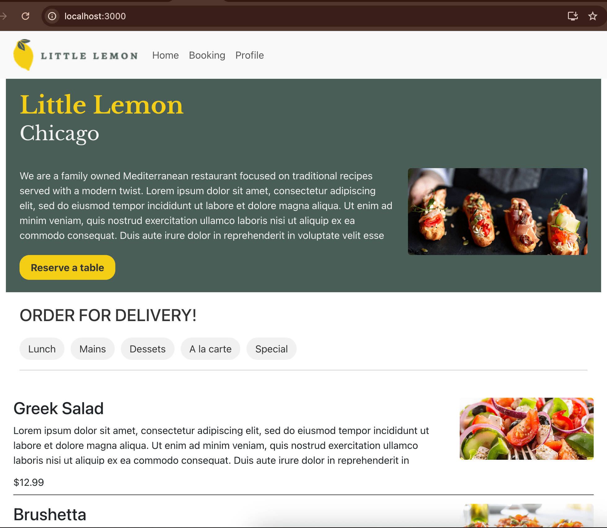

# BQuezada Little Lemon 
## ReactJS Coursera - Booking a table website

ReactJS Website using 

- Bootstrap
- Formik
- Json Server

## Instructions

- Before all install the dependences npm install
- Go to the folder coursera-module5 > src > data and run the cmd: json-server --watch db.json --port 3030
- Verify the json server is running at http://localhost:3030/menu
- Go to the root folder of the project and run the npm start
- To verify the test run: npm run at the root folfer

### Home
Reserve a table link to the booking page
The tables or menu is fetch from Json file

#### Home Desktop

#### Home Tablet

#### Home Mobile

### Booking
Reserve a table using the form

#### booking Desktop

#### booking Tablet

#### booking Mobile

### Profile
Save and update information about the user using the form

#### profile Desktop

#### profile Tablet

#### profile Mobile

### Testing

